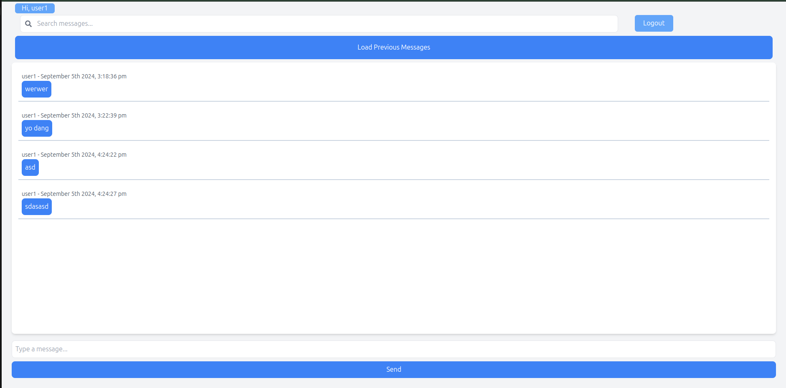

# Realtime Messaging

## 1. Stack:
- Backend build with django Rest Framework
- Frontend build with React
- Redis as a channel layer mediator.
- Sqlite DB as a backend database.

## 2. Versioning

```
python-3.12.3
node-20.16
```

## 3. Directory Structure:

```sh
├── docker-compose.yml
├── backend
│   ├── Dockerfile
│   ├── .env (backend env)
│   ├── messaging
│   ├── requirements.txt
│   └── start_backend.sh
├── frontend
│   ├── Dockerfile
│   ├── eslint.config.js
│   ├── index.html
│   ├── package.json
│   ├── .env (frontend env)
│   ├── postcss.config.js
│   ├── public
│   ├── src
│   ├── start_frontend.sh
│   ├── tailwind.config.js
│   ├── vite.config.js
│   └── yarn.lock
└── README.md
```

## Environment Variables And Configuration:

We've couple of environment 

## Screenshoot

**Chat Window:**



